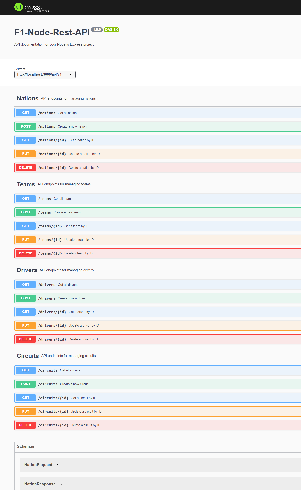

# f1-node-rest-db-api

## Description

A project using Node.js, Express, and Knex to create a REST API for a database based on Formula 1.

## Installation on Local Machine

1. Clone the repo: `git clone`
2. Install dependencies: `npm install`
3. [OPTIONAL] Create a `.env` file based on the `.env.example` file
4. Run the migrations: `npx knex migrate:latest`
5. [OPTIONAL] Run the seed: `npx knex seed:run`
6. Start the server: `npm start`
  You should see the following message in the terminal: `Server running on port 3000`
7. Open your browser and navigate to `localhost:3000`
8. You should see the following image:

9. You can use the Swagger UI to test the API endpoints at `localhost:3000/api-docs`
